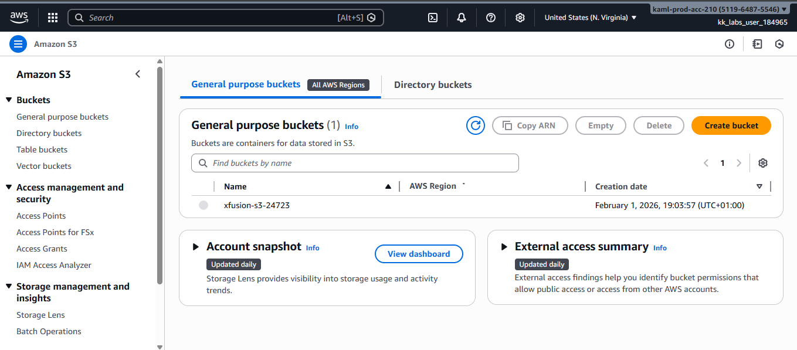
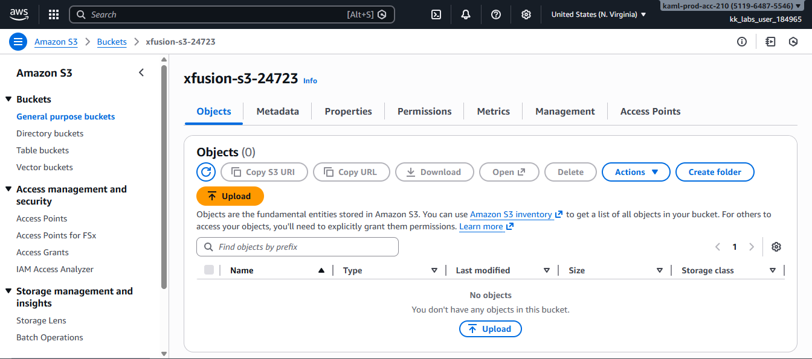
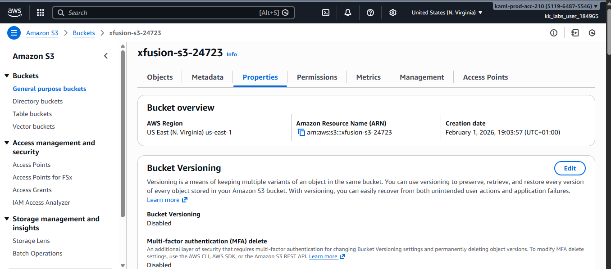
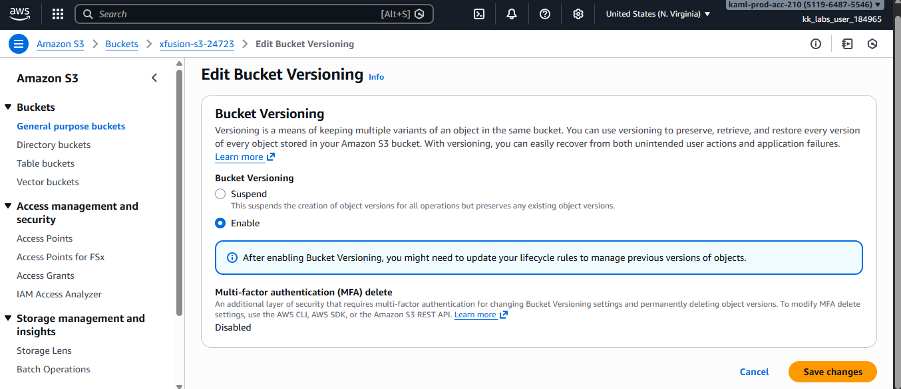
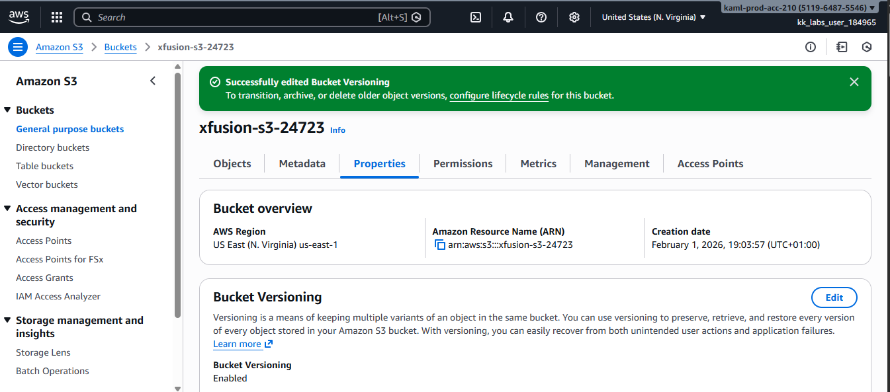

# AWS-S3-Bucket-Versioning-Guide

This guide demonstrates how to enable **versioning** on an Amazon S3 bucket using the AWS Management Console (GUI).  
Bucket versioning is a key data protection feature that helps recover objects in case of accidental deletion or overwrite.

## What is S3 Versioning?

S3 versioning allows you to keep **multiple versions of an object** in the same bucket.  
When enabled:
- Deleted objects are not permanently removed
- Overwritten files can be restored
- Data recovery becomes easier and safer

This feature is commonly used for **backup, disaster recovery, and compliance**.

## Step 1: Log in to the AWS Console

Sign in to the AWS Management Console and ensure the correct region is selected.

## Step 2: Navigate to Amazon S3

- From the AWS services menu, search for **S3**
- Click **Amazon S3** to open the S3 dashboard

## Step 3: Select the S3 Bucket

From the list of buckets, click on: `xfusion-s3-24723`

## Step 4: Open the Properties Tab

- Inside the bucket, click on the **Properties** tab
- Scroll down to the **Bucket Versioning** section

## Step 5: Enable Bucket Versioning

- Click **Edit** in the Bucket Versioning section
- Select **Enable**
- Click **Save changes**

## Step 6: Confirm Versioning Status

Once enabled, the Bucket Versioning status should show as **Enabled**.

## Conclusion
•	Enabling S3 bucket versioning is a simple but powerful step toward protecting your data from accidental loss.  
•	setup is essential for production workloads and aligns with AWS best practices for data durability and recovery.

